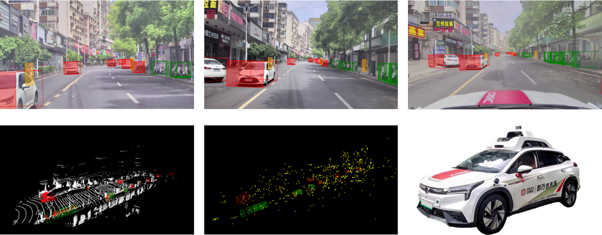
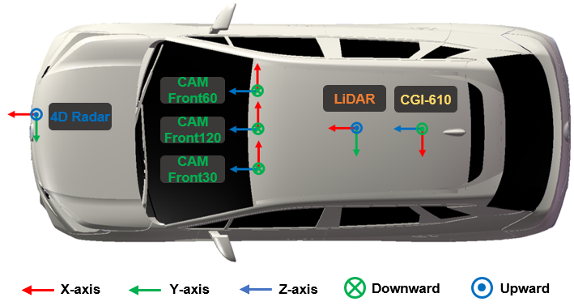
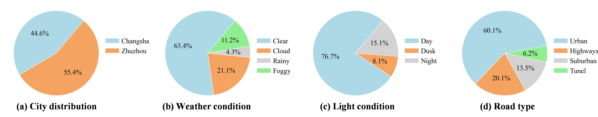

<p align="center">
  
</p>

# L-RadSet: A Long-range Multimodal Dataset with 4D Radar for Autonomous Driving and Its Application
<p style=""text-align:justify; text-justify:interideograph;">
A long-range and robust perception system plays a crucial role in advancing research and deployment of autonomous driving. 4D radar, as an emerging range sensor, offers superior resilience to adverse weather conditions than lidar and provides elevation measurement compared to 3D radar. Existing 4D radar datasets, emphasizing robust and multimodal perception, typically combine camera, lidar, and 4D radar. However, they often lack long-range capability due to limited annotations. Furthermore, the configuration of their single short-focus camera fails to effectively match a long-range 4D radar. To overcome these limitations, we present a novel long-range multimodal dataset. It encompasses high-resolution and long-range sensors, including forward-facing cameras, a 360° lidar, and a front-mounted 4D radar, along with detailed annotations for 3D objects. Particularly, our dataset introduces, for the first time, three cameras with different focal lengths, enabling simultaneous capture of images with varying perception ranges. It serves as a valuable resource for developing accurate long-range perception algorithms. Remarkably, our dataset achieves the longest annotation ranges among comparable 4D radar datasets, spanning up to 220 meters. It supports applications such as 3D object detection and tracking, as well as facilitates the study of multimodal tasks. Through rigorous experiments, we validate the efficacy of our dataset and offer valuable insights into long-range 3D object detection. 
</p>


# News

<strong>[2024.04.17]  We have released the dataset download [link](#downloadlink). </strong> 

[2024.04.17] Our Code currently supports some baselines including DETR3D, Pointpillars, Second, and PV-RCNN. 

# 1. Introduction
<p style=""text-align:justify; text-justify:interideograph;">
L-RadSet includes over 133K high-quality, manually annotated 3D ground bounding boxes, covering nine categories of static and dynamic objects within a long range of up to 220 meters. Each ground truth box is accompanied by a track identifier to facilitate 3D object tracking. Furthermore, our dataset comprises 280 meticulously selected driving scenes, each spanning 20 seconds. These scenes consist of a total of 11.2K keyframes, capturing data from diverse real-world traffic scenarios. For training and validation purposes, we partitioned these scenes into 225 samples, reserving 55 scenes for testing. 
</p>


<div align=center>
<table class="table-noborder">
  <tr>
    <td align="center">
      <figure>
        
      </figure>
      <p align="center"><font face="Helvetica" size=2.><b>a) Ego vehicle's work scenario</b></font></p>
    </td>
  </tr>
</table>
<p align="center"><font face="Helvetica" size=3.><b>Figure 1. Visulization of the data from different sensors and the platform</b></font></p>
</div>

### Sensor Configuration 

Our ego vehicle is equipped with three front-view cameras featuring varying focal lengths and field-of-view (FOV) characteristics, as depicted in Figure 2. This configuration enhances the ability to perceive distant objects captured by the images within a wide horizontal field of view. Furthermore, our top lidar captures data within a 360° horizontal field of view, reaching a range of up to 230 meters. This high-resolution and long-range capability enables precise and distant annotations in our dataset. Additionally, our 4D radar covers a forward range of 120° and can detect objects up to 300 meters away. These sensors play a crucial role in facilitating the development of effective long-range and robust perception algorithms within our dataset. Moreover, our autonomous driving platform incorporates GNSS (Global Navigation Satellite System) and IMU (Inertial Measurement Unit) systems to provide and collect accurate location information.  

<div align=center>

</div>
<p align="center"><font face="Helvetica" size=3.><b>Figure 2. Sensor setup for our data collection platform</b></font></p>


* The specification of the autonomous vehicle system platform. Our proposed dataset is collected from a high-resolution camera, an 80-line mechanical LiDAR, and two types of 4D radars, the Arbe Phoenix and the ARS548 RDI radar. Our dataset provides GPS information for timing implementation. The sensor configurations are shown in Table 1.

<div align=center>
<p align="center"><font face="Helvetica" size=3.><b>Table 1. The sensor specification of the data collection platform</b></font></p>
<table>
     <tr>
        <td rowspan="2" align=center>Sensors</td>
        <td rowspan="2" align=center>Type</td>
        <td rowspan="2" align=center>View</td>
        <td rowspan="2" align=center>Number</td>
        <td colspan="3" align=center>Resolution</td>
        <td colspan="3" align=center>Field of view</td>
        <td rowspan="2">FPS</td>
     </tr>
      <tr>
        <td>Range</td>
        <td>Azimuth</td>
        <td>Elevation</td>
        <td>Range</td>
        <td>Azimuth</td>
        <td>Elevation</td>
     </tr>
      <tr>
        <td align=center>Camera</td>
        <td align=center>SG2-IMX390C-5200-GMSL2</td>
        <td align=center>Front</td>
        <td align=center>3</td>
        <td align=center>-</td>
        <td align=center>1920px</td>
        <td align=center>1080px</td>
        <td align=center>-</td>
        <td align=center>30°/60°/120°</td>
        <td align=center>17°/32°/62°</td>
        <td align=center>30</td>
     </tr>
     <tr>
        <td align=center>LiDAR</td>
        <td align=center>RS-Ruby Lite</td>
        <td align=center>360°</td>
        <td align=center>1</td>
        <td align=center>0.05m</td>
        <td align=center>0.2°</td>
        <td align=center>0.1°</td>
        <td align=center>230m</td>
        <td align=center>360°</td>
        <td align=center>-25°~15°</td>
        <td align=center>10</td>
     </tr>
     <tr>
        <td rowspan="2" align=center>4D radar</td>
        <td align=center>ARS 548RDI</td>
        <td align=center>Front</td>
        <td align=center>1</td>
        <td align=center>0.22m</td>
        <td align=center>1.2°@±15°<br>1.68°@±45°</td>
        <td align=center>2.3°</td>
        <td align=center>300m</td>
        <td align=center>±60°</td>
        <td align=center>±14°@<100m<br>±4°@300m</td>
        <td align=center>20</td>
     </tr>
</table>
</div>

# 2. Data Acquisition and Distribution

* We analyze the distribution of frames across different weather conditions, times of day, and road types. As visually depicted in Fig. 4(b) and (c), our data collection process involved capturing various weather conditions, such as clear, cloudy, rainy, and foggy scene, as well as different light conditions, ranging from daytime to dusk and nighttime situations. Notably, our dataset includes a significant proportion of nighttime scenes, thereby encompassing more challenging scenarios to develop more robust detection algorithms. Additionally, to cover a comprehensive array of driving scenarios, we meticulously collected data from urban roads, highways, suburban roads, and tunnel scenarios, as presented in Fig. 3(d). This data collection strategy ensures the inclusion of a diverse set of real-world traffic scenes, facilitating the creation of a more comprehensive dataset.
<div align=center>

</div>
<p align="center"><font face="Helvetica" size=3.><b>Figure 4. Distribution of sampled cities (a), weather conditions (b), time of day (c), and road types (d) in L-RadSet. Our dataset collects data from two different cities, which encompasses four weather conditions, three light conditions from day to night, and four road types. </b></font></p>

# 3. Data visulization

* We present various driving scenes in Fig. 5. These scenes encompass typical driving environments such as urban, suburban, and highway, as well as some challenging scenarios like nighttime, adverse weather, and low-light tunnel. As can be seen in Figure 7(d), (e), and (h), the camera is highly affected by light, and the captured images even lack RGB information to observe the object when the light is extremely weak. Therefore, in this scenario, lidar can acquire very tight spatial information, compensating for the camera’s shortcomings. In addition, adverse weather such as fog and rain can also affect image quality to some extent, but the performance degradation is much lower than the effect of low light, as shown in Figure 6(b) and (c). Adverse weather tends to cause the lidar to produce more noise, which affects its detection. In this case, the semantic information of the image and the accurate 3D measurements provided by the 4D radar point cloud can be used to enhance the detection performance.

<div align=center>

</div>
<p align="center"><font face="Helvetica" size=3.><b>Figure 5. The Scene visualization of L-RadSet captured by front 60° camera in different weathers, light conditions and road types. (a) urban clear daytime, (b) suburban light-fog daytime, (c) urban rainy daytime, (d) urban cloudy nighttime, (e) tunnel daytime, (f) suburban cloudy dusk, (g) highway clear daytime, (h) highway cloudy nighttime. </b></font></p>

<a id="downloadlink"></a>
# 4. Download Link
* Our dataset is freely available to researchers. Please download and sign our [agreement](https://drive.google.com/file/d/1Zl9sTGBCUQAH0Kn4_66URL8d9f6tqVWr/view?usp=drive_link) and send it to the provided email address (<b>jzhong_l@163.com</b>). You will receive the download link within one week.

* When unzipping the data, please file and organize it by following the format below:
```
    └─L-RadSet
    ├─ImageSets.zip
    ├─calibs.zip
    ├─labels.zip
    ├─timestamp.zip
    ├─images
    │  ├─image_0.zip
    │  ├─image_1.zip
    │  ├─image_2.zip
    ├─lidar.zip
    ├─radar.zip
    ├─detection.json
    ├─detection_long.json
    └─README.md
```
* This folder contains 11200 frames of labeled pointclouds and image data. The structure of the folder can be softly linked in data folder. The entire structure is shown as blow:
```
    └─L-RadSet
    ├─ImageSets
    │      test.txt
    │      train.txt
    │      trainval.txt
    │      val.txt
    ├─calib
    │  ├─ 000000.txt
          ..........
    ├─image
    |  ├─image_0
    |  │ │ 000000.png	# Undistort images of the camera 30°.
    │  │   ..........
    |  ├─image_1
    |  │ │ 000000.png	# Undistort images of the camera 60°.
    │  │ | ..........
    |  ├─image_2
    |  │ │ 000000.png	# Undistort images of the camera 120°.
    │  │ | ..........
    ├─lidar
    │  │ 000000.bin	# point cloud in bin format.
    │  │ ..........
    ├─radar
    │  │ 000000.bin	# point cloud in bin format.
    │  │ ..........
    ├─labels
    │  │ 000000.txt	# Label in txt format.
    │  │ ..........
    ├─timestamp
    │  │ 000000.txt	# timestamp in txt format.
    │  │ ..........
    ├─anchor_size.json
    ├─detection.json
    ├─detection_long.json
    └─README.md
```
# 5. The Description of Calib Format

* The calib.txt contains three parts. 
```
   Intrinsics of each camera: matrix P(4×4)
   Extrinsics of LiDAR to each camera: matrix P(4×4)
   Distortion parameters: matrix P(1×5)
```
# 6. Label Files Discription
* <b>All values (numerical or strings) are separated via spaces, each row corresponds to one object. The 19 columns represent:</b>
```
  Value       Name             Description
  -------------------------------------------------------------------------------------------------------
  1        type               Describes the type of object: 'Car', 'Bus', 'Truck', 'Motorbike',  'Bicycle', 'Person', 'Child', 'Traffic_cone' and 'Barrier'
  1        truncated          Float from 0 (non-truncated) to 1 (truncated), where truncated refers to the object leaving image boundaries
  1        occluded           Integer (0,1,2,3) indicating occlusion state: 0 = fully visible, 1 = partly ccluded, 2 = largely occluded, 3 = unknown
  1        alpha              Observation angle of object, ranging [-pi..pi]
  4        bbox               2D bounding box of object in the image (0-based index): contains left, top, right, bottom pixel coordinates. 
  3        dimensions         3D object dimensions: height, width, length (in meters).
  3        location           3D object location x,y,z in LiDAR coordinates (in meters).
  1        rotation_y         Rotation ry around Z-axis in LiDAR coordinates [-pi..pi].
  1        score              Only for results: Float,indicating confidence in detection, needed for p/r curves , higher is better.
 ```

# 7. Getting Started

### Environment
This is the documentation for how to use our detection frameworks with L-RadSet dataset.
We test the L-RadSet detection frameworks on the following environment:

* Python 3.8.16
* Ubuntu 18.04
* Torch 1.9.1+cu111 or higher
* CUDA 11.1 or higher
* mmdet3d 1.1.1
* mmdet 3.0.0rc5
* mmengine 0.7.4
* setuptools 58.0.4

### Preparing The Dataset

* After all files are downloaded, please arrange the workspace directory with the following structure:


* Organize your code structure under mmdetection3d framework, as follows
```
    mmdetection3d
      ├── checkpoints
      ├── configs
      ├── data
      ├── mmdet3d
      ├── projects
      ├── tools
      ├── work_dirs
```
* Organize the dataset according to the following file structure under the data folder
```
    └─L-RadSet
    ├─ImageSets
    │      test.txt
    │      train.txt
    │      trainval.txt
    │      val.txt
    ├─calib
    │  ├─ 000000.txt
          ..........
    ├─image
    |  ├─image_0
    |  │ │ 000000.png	# Undistort images of the camera 30°.
    │  │   ..........
    |  ├─image_1
    |  │ │ 000000.png	# Undistort images of the camera 60°.
    │  │ | ..........
    |  ├─image_2
    |  │ │ 000000.png	# Undistort images of the camera 120°.
    │  │ | ..........
    ├─lidar
    │  │ 000000.bin	# point cloud in bin format.
    │  │ ..........
    ├─radar
    │  │ 000000.bin	# point cloud in bin format.
    │  │ ..........
    ├─labels
    │  │ 000000.txt	# Label in txt format.
    │  │ ..........
    ├─timestamp
    │  │ 000000.txt	# timestamp in txt format.
    │  │ ..........
    ├─anchor_size.json
    ├─detection.json
    ├─detection_long.json
    └─README.md
```
### Requirements

* Clone the repository

```
 git clone https://github.com/crrasjtu/L-RadSet.git
```

* Create a conda environment\
You can follow the official installation of [mmdetection3d](https://mmdetection3d.readthedocs.io/en/latest/get_started.html) 
* Note
1. Change the mmdetection3d version into 1.1.1 before you compile it
```
 git checkout v1.1.1
```
2. Put the our files into the corresponding folders

### Train & Evaluation
* Generate the data infos by running the following command
1. using lidar & image data
```
python tools/create_data.py l-radset --root-path ./data/l-radset --out-dir ./data/l-radset --extra-tag l-radset 
```

2. using 4D radar & image data
```
python tools/create_data.py radset --root-path ./data/l-radset --out-dir ./data/l-radset --extra-tag radset
```

* To train the model on single GPU, prepare the total dataset and run
```
python train.py ${CONFIG_FILE}
```
* To train the model on multi-GPUs, prepare the total dataset and run
```
tools/dist_train.sh ${CONFIG_FILE} ${NUM_GPUS} 
```
* To evaluate the model on single GPU, modify the path and run
```
python test.py ${CONFIG_FILE} ${CKPT}
```
* To evaluate the model on multi-GPUs, modify the path and run
```
tools/dist_train.sh ${CONFIG_FILE} ${CKPT} ${NUM_GPUS} 
```

# 8. Experiment results
1. 3D object detection 
<div align=center>
<p align="center"><font face="Helvetica" size=3.><b>Table 2. Experimental results of all baselines in 3D object detection</b></font></p>
<table>
     <tr align=center>
        <td rowspan="1">Baselines</td> 
        <td rowspan="1" align=center>Sensor</td> 
        <td colspan="1" align=center>mAP</td>
        <td colspan="1" align=center>CDS</td>
        <td colspan="1" align=center>mATE</td>
        <td rowspan="1" align=center>mASE(1-IoU)</td>
        <td rowspan="1" align=center>mAOE</td>
        <td rowspan="1" align=center>ckpts</td>
    </tr>
    <tr align=center>
        <td rowspan="2">DETR3D</td> 
        <td>C1</td>
        <td>0.426</td>
        <td>0.515</td>
        <td>0.821</td>
        <td>0.213</td>
        <td>0.300</td>
        <td><a href="https://drive.google.com/file/d/1Jkm6kPf1pyjuhZiVNJ7hKGvsbAEQvP9r/view?usp=sharing">model</a></td>
    </tr>
    <tr align=center>
        <td>C1, C2</td>
        <td>0.451</td>
        <td>0.524</td>
        <td>0.757</td>
        <td>0.207</td>
        <td>0.278</td>
        <td><a href="https://drive.google.com/file/d/1iq5h5IqyNveNfIJe0Ua8fwyYi5aygDk2/view?usp=sharing">model</a></td>
    </tr>
    <tr align=center>
        <td rowspan="1">PointPillars</td> 
        <td>L</td>
        <td>0.648</td>
        <td>0.681</td>
        <td>0.303</td>
        <td>0.198</td>
        <td>0.360</td>
        <td><a href="https://drive.google.com/file/d/1ztdeQNoOcIXPHRganyAexk_hx_MrJyrf/view?usp=sharing">model</a></td>
    </tr>
    <tr align=center>
        <td rowspan="1">SECOND</td> 
        <td>L</td>
        <td>0.653</td>
        <td>0.692</td>
        <td>0.280</td>
        <td>0.181</td>
        <td>0.346</td>
        <td><a href="https://drive.google.com/file/d/1sHkngf_JiodWfc5yaxq3GWRSCT-S7dBb/view?usp=sharing">model</a></td>
    </tr>
      <tr align=center>
        <td rowspan="1">PVRCNN</td> 
        <td>L</td>
        <td>0.680</td>
        <td>0.724</td>
        <td>0.206</td>
        <td>0.177</td>
        <td>0.315</td>
        <td><a href="https://drive.google.com/file/d/1vCzgyMGfXaPS4ce733svjhlnsiYZs7Tm/view?usp=sharing">model</a></td>
    </tr>
      <tr align=center>
        <td rowspan="1">PointPillars</td> 
        <td>R</td>
        <td>0.403</td>
        <td>0.517</td>
        <td>0.604</td>
        <td>0.236</td>
        <td>0.188</td>
        <td><a href="https://drive.google.com/file/d/1RNWtkgWlBwpsqYPpECd0xins4k-tDLnL/view?usp=sharing">model</a></td>
    </tr>
    <tr align=center>
        <td rowspan="1">SECOND</td> 
        <td>R</td>
        <td>0.324</td>
        <td>0.451</td>
        <td>0.670</td>
        <td>0.262</td>
        <td>0.331</td>
        <td><a href="https://drive.google.com/file/d/1IE_em2ITv-ylulnUH6wtJ8ne3rA3lNvq/view?usp=sharing">model</a></td>
    </tr>
      <tr align=center>
        <td rowspan="1">PVRCNN</td> 
        <td>R</td>
        <td>0.351</td>
        <td>0.475</td>
        <td>0.649</td>
        <td>0.255</td>
        <td>0.302</td>
        <td><a href="https://drive.google.com/file/d/1O0dInnwu7ix8NbBKY_L72IKdWFXuLMRf/view?usp=sharing">model</a></td>
    </tr>
</table>
</div>


# 9. Acknowledgement
1. Many thanks to the following open-source projects:
* [mmdetection3d](https://github.com/open-mmlab/mmdetection3d)
* [DETR3D](https://github.com/WangYueFt/detr3d)
2. The computations were partly run on the Siyuan-1 cluster supported by the Center for High Performance Computing at Shanghai Jiao Tong University.

